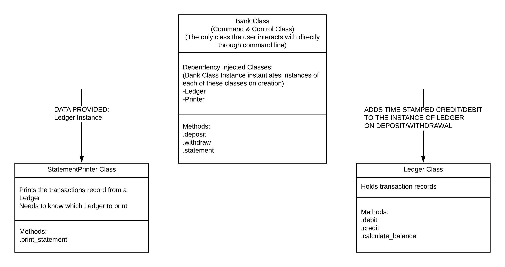

# Bank Tech Test

This is a submission for a practice tech test at the Makers Academy. 

## Specifications
### Requirements

- You should be able to interact with your code via a REPL like IRB or the JavaScript console. (You don't need to implement a command line interface that takes input from STDIN.)
- Deposits, withdrawal.
- Account statement (date, amount, balance) printing.
- Data can be kept in memory (it doesn't need to be stored to a database or anything).

### Acceptance Criteria

- __Given__ a client makes a deposit of 1000 on 10-01-2012
- __And__ a deposit of 2000 on 13-01-2012
- __And__ a withdrawal of 500 on 14-01-2012
- __When__ she prints her bank statement
- __Then__ she would see:
```
date || credit || debit || balance
14/01/2012 || || 500.00 || 2500.00
13/01/2012 || 2000.00 || || 3000.00
10/01/2012 || 1000.00 || || 1000.00
```

## Approaching the problem

### User stories

From the specifications above I prepared the following user stories:
```
As a Customer,
So that I can keep my money safe
I would like to be able to deposit cash in Bank

As a Customer 
So that I can get access to the money I deposited
I would like to withdraw the cash from the Bank

As a Customer
So that I can see what is happening with my money
I would like to print out a statement of transactions

As a Customer
So that I can see how much money I have left
I would like my statement to show balance after each transaction

As a Customer
So that I can see what transaction took place when
I would like my statement to show the date of each transaction

As a Customer
So that I can see the context of my transactions
I would like my statement to show latest entries first
```

### Domain Object Model

From the User Stories above, I created the following DOM table:

|Object|Message|
|:---:|:---:|
|User| |
|Bank|.deposit(amount)|
| |.withdraw(amount)|
| |.statement

### Diagramming the Structure

Drawing on my understanding of the OOP practices, I have created the following diagram for my program:




## Getting Started

### Instructions

To play around with this implementation, do the following:

1. Fork and clone the repo
2. `cd` into the directory where you placed the cloned repo
3. Run `bundle install`
4. Fire up your favourite REPL (I prefer PRY, but IRB would do).
5. Then:
- type `require './lib/bank.rb'` (this will load up the bank.rb file (main application file) into the REPL)
- create new bank like so `bank = Bank.new`
- now you can:
 
  - __deposit__ funds like so `bank.deposit(amount)` where the _amount_ can be any positive number greater than 0 (0 or negative numbers will throw an error)
  - __withdraw__ funds like so `bank.withdraw(amount)` where the _amount_ can be any positive number greater than 0 (0 or negative numbers will throw an error)
  - obtain a __statement__ like so `bank.statement`

### Demo
```
[1] pry(main)> require './lib/bank.rb'
[2] pry(main)> bank = Bank.new
[3] pry(main)> bank.deposit(1000)
[4] pry(main)> bank.deposit(2000)
[5] pry(main)> bank.withdraw(500)
[6] pry(main)> bank.statement
date || credit || debit || balance
19/06/2018 ||  || 500.00 || 2500.00
19/06/2018 || 2000.00 ||  || 3000.00
19/06/2018 || 1000.00 ||  || 1000.00
[7] pry(main)>
```

## Running the tests

I used RSpec for testing and Simplecov for coverage analysis. 

The testing can be done by running `rspec` in the command line

The output should be:
```
16 examples, 0 failures, 16 passed
```
```
COVERAGE: 100.00% -- 105/105 lines in 6 files
```

### Break down of tests

The tests breakdown is as follows

```
Bank
  #deposit
    should take an amount to be deposited
    should throw an error if the #deposit amount is less than 0
    should throw an error if the #deposit amount is 0
    should credit the Ledger Class
  #withdraw
    should take an amount to be withdrawn
    should credit the Ledger Class
    should raise an error if the #withdraw amount is less than 0
    should check with Ledger Class that the withdrawal does not exceed the available
 balance
    should raise error if the #withdrawal amount exceeds the available balance
  #statement
    should call the StatementPrinter Class and provide a ledger

Ledger
  #debit
    should respond to the #debit method
    should push amount and transaction timestamp into @transactions record array
  #credit
    should respond to the #credit method
    should push amount and transaction timestamp into @transactions record array

StatementPrinter
  #print_statement
    should respond to #print_statement with 1 argument
    should print the statement to the screen with a heading
```

### Coding Style Tests

Rubocop is used to monitor code style (which detects one offence at the moment - a line being too long on the statement printer.)

```
Inspecting 4 files
...C

Offenses:

lib/statement_printer.rb:6:81: C: Metrics/LineLength: Line is too long. [170/80]

4 files inspected, 1 offense detected


```

## Possible Improvements

 - Nice looking command-line interface menu (old ATM-style)
 - Allow users to select which period they would like to print a statement for
 - Adding withdrawal charges, interest accrual, etc.


## Authors

* **Igor Ryabchuk** 

## Acknowledgments

* Makers Academy for making me love coding more than I thought I could.